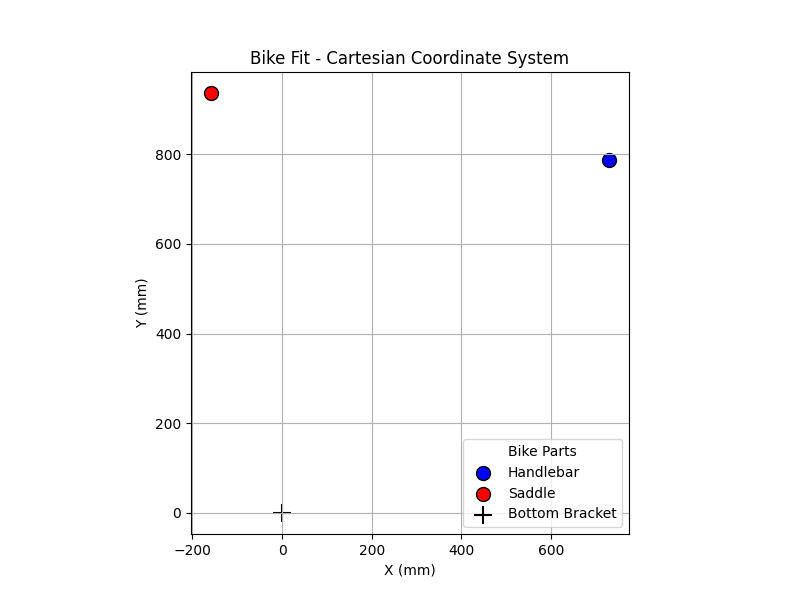
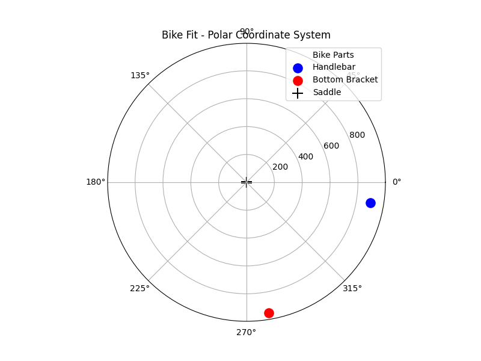
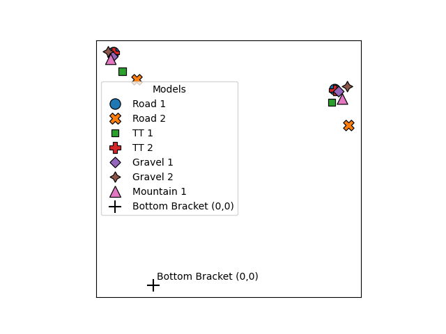
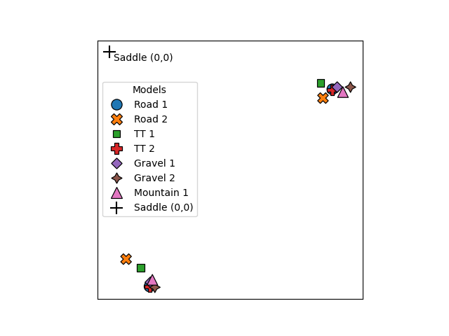
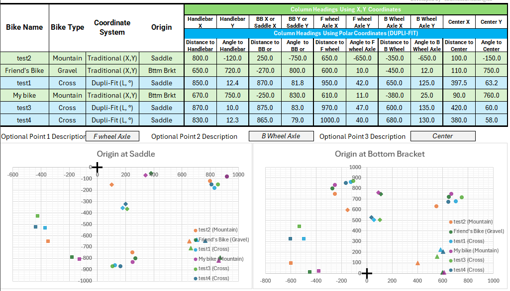

# 🚴 Dupli-Fit: Bicycle Fit Data Analysis

[**Dupli-Fit**](https://archdesignwork.com/pages/dupli-fit) is a tool for measuring bicycle geometry.  
This package provides analysis and visualization of data collected with **Dupli-Fit**,  
allowing for easy comparison of different bike models.  

It converts **measured polar coordinates (with the saddle as the origin)**  
into a **Cartesian coordinate system (with the bottom bracket as the origin)**  
— a standard approach in professional bike fitting.

---

## 📌 Features

✅ Converts **polar coordinates** (with saddle as the origin) to **Cartesian coordinates** (with bottom bracket as the origin).  
✅ Automatically fills in missing coordinate values.  
✅ Provides **visualization** in both coordinate systems.  
✅ Supports multiple bike models for direct comparison.  

---

## 📌 Installation

### **1️⃣ Clone the repository**
```sh
git clone https://github.com/pavel-pikuza/dupli-fit.git
```

### **2️⃣ Install dependencies**
```sh
pip install -r requirements.txt
```

---

## 📌 Usage

Run the main script to generate visualizations:
```sh
python bike_fit.py
```

### **Example Output:**
The program will generate **4 plots**:
1. **Bike geometry in Cartesian coordinates**  
2. **Bike geometry in Polar coordinates**  
3. **Comparison of multiple bikes (bottom bracket as origin)**  
4. **Comparison of multiple bikes (saddle as origin)**  

---

## 📌 File Structure

```
dupli-fit/
├── bike_fit.py                     # Main script for coordinate conversion & visualization
├── doc/
│   ├── example_cartessian.png      # Sample Cartesian plot
│   ├── example_polar.png           # Sample Polar plot
│   ├── multiple_bikes_bb.png       # Bikes comparison (center in Bottom Bracket)
│   ├── multiple_bikes_s.png        # Bikes comparison (center in Saddle)
│   ├── excel_version.png           # Excel-based version (available on https://archdesignwork.com)
├── requirements.txt                # Dependencies
└── README.md                       # Project documentation (this file)
```

---

## 📌 How It Works

### **1️⃣ Data Format**
Read bikes data from csv file. 
If **Cartesian coordinates are missing**, the program **calculates them from polar coordinates**.  
If **Polar coordinates are missing**, it **converts from Cartesian**.

---

### **2️⃣ Coordinate Transformations**
The program includes the following transformations:

✔️ `to_cartesian()` - Converts **polar** to **Cartesian**  
✔️ `to_polar()` - Converts **Cartesian** to **polar**  
✔️ `shift_coordinates()` - Moves coordinate system to a new reference point  

---

### **3️⃣ Visualization**
- **`plot_cartesian()`** - Plots bikes in Cartesian coordinates.
- **`plot_polar()`** - Plots bikes in Polar coordinates.
- **`plot_bike_geometry()`** - Allows switching the reference point (bottom bracket vs saddle).

---

## 📌 Example Plots

### **📍 Cartesian Coordinates**


### **📍 Polar Coordinates**


### **📍 Bikes comparison with center in Bottom Bracket**


### **📍 Bikes comparison with center in Saddle**


---

### **📌 Excel-based tool**
A spreadsheet-based version of this tool is available on [Arch Design Works](https://archdesignwork.com).


---

## 📌 License
This project is licensed under the **MIT License**.

---

🚀 **Enjoy analyzing your bike geometry with Dupli-Fit!**
